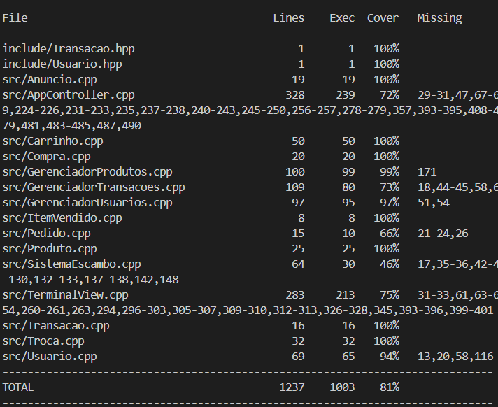

# Sistema Escambo — Plataforma de E-commerce via Terminal

> Projeto Final — PDS2 2026 | Grupo 9  

## Integrantes

| Nome | Matrícula |
|---|---|
| Gustavo Clementino | 2024055472 |
| Vladimir Timóteo | 2025019330 |
| Marcelo Rodrigues | 2025019321 |
| Igor Hendrix | 2025500135 |
| Henrique de Freitas Vicente | 2024082437 |

---

## Descrição

O *Sistema Escambo* é uma plataforma de e-commerce via terminal em C++ inspirada no modelo da OLX. O sistema permite que um mesmo usuário atue tanto como comprador quanto como anunciante dentro de um único login, gerenciando anúncios de produtos novos e usados com categorização dinâmica e persistência de dados em arquivos .txt.

O diferencial central é o mecanismo de *e-scambo*: usuários podem propor trocas diretas de produtos sem envolver dinheiro, desde que os valores sejam compatíveis dentro de uma margem de tolerância de 20%.

---

## Funcionalidades

*Conta e autenticação*
- Cadastro com nome, e-mail (login), senha e chave Pix
- Login seguro com validação encapsulada na própria classe Usuario
- Perfil híbrido: o mesmo usuário alterna entre modo Comprador e modo Anunciante

*Capacidades e progressão do usuário* (implementado em Usuario)

Cada usuário possui um conjunto de *capacidades* (permissões binárias) e um *nível* derivado do histórico de vendas/trocas concluídas como vendedor:

| Capacidade | Como se obtém |
|---|---|
| COMPRAR | Concedida automaticamente no cadastro |
| ANUNCIAR | Concedida automaticamente no cadastro (sujeita ao limite de anúncios do nível) |
| TROCAR | *Desbloqueada* após a 1ª compra concluída como comprador |

| Nível | Como se obtém | Limite de anúncios ativos simultâneos |
|---|---|---|
| INICIANTE | Estado inicial de todo usuário | *3* anúncios (LIMITE_ANUNCIOS_INICIANTE) |
| VETERANO | *Desbloqueado* ao concluir 3 vendas/trocas como vendedor (VENDAS_PARA_VETERANO) | Ilimitado |

A capacidade TROCAR é checada antes de exibir a opção de propor escambo no menu do comprador, e o limite de anúncios é checado em podeCriarAnuncio() antes de o anunciante cadastrar um novo produto — ambos os controles ficam encapsulados na própria classe Usuario, não espalhados pela View ou pelo Controller.

*Como anunciante*
- Cadastrar produtos com nome, preço, categoria, subcategoria e quantidade em estoque
- Editar e inativar anúncios existentes
- Visualizar produtos próprios
- Receber, aceitar ou rejeitar propostas de troca recebidas

*Como comprador*
- Navegar pela vitrine com filtro por categoria e subcategoria
- Adicionar produtos ao carrinho (com persistência entre sessões)
- Finalizar compra via Pix — debita estoque automaticamente
- Propor trocas (e-scambo) para produtos de outros usuários
- Acompanhar histórico de propostas enviadas

*Sistema de transações*
- Compras registradas com status (PENDENTE, CONCLUÍDA, REJEITADA)
- Trocas validadas por margem de preço e estoque disponível
- Histórico persistido em transacoes.txt

---

## Arquitetura

O projeto segue uma adaptação do padrão *MVC*, com a camada de domínio organizada em torno de uma classe agregadora (SistemaEscambo) que possui os repositórios e concentra as regras de negócio:

TerminalView (View)              ← I/O via cout / cin
        ↑
AppController (Controller)       ← fluxos de menu, decisões
        ↓
SistemaEscambo (Model)           ← agrega repositórios e regras de negócio
        ├── GerenciadorUsuarios   → data/usuarios.txt
        ├── GerenciadorProdutos   → data/produtos.txt    (Repositories)
        └── GerenciadorTransacoes → data/transacoes.txt

- *TerminalView* é a única classe que toca em cout/cin — não decide nada, só apresenta e coleta entrada.
- *AppController* orquestra os fluxos de menu: pergunta à View, decide, chama o Model.
- *SistemaEscambo* é o *Model*: agrega os três Gerenciador* (que funcionam como Repositories, cada um responsável pela persistência de uma entidade) e implementa as regras de negócio que cruzam mais de um repositório — finalizarCompra() cria uma Compra, valida estoque e grava o histórico; enviarPropostaTroca() gera ID, valida margem de preço e persiste; processarRespostaTroca() aceita/rejeita uma troca e debita o estoque dos dois lados.

> *Nota sobre nomenclatura:* alguns métodos de SistemaEscambo atuam como fachada (finalizarCompra, processarRespostaTroca) por esconderem a orquestração entre múltiplos gerenciadores. A classe como um todo, porém, não é uma Facade no sentido estrito do GoF — ela é dona do estado e expõe os repositórios (getUsuarios(), getProdutos(), getTransacoes()) para consultas pontuais feitas pelo Controller, o que descaracteriza o padrão Facade puro.

### Hierarquia de classes principais

Transacao  (classe base abstrata)
├── Compra     — compra direta via Pix
└── Troca      — proposta de e-scambo entre usuários

Transacao declara validar_transacao() e executar_transacao() como puramente virtuais. Cada subclasse implementa suas próprias regras de negócio sem que os gerenciadores precisem saber o tipo concreto (Open/Closed Principle).

### Estrutura de diretórios

PDS2-2026-PF-grupo9/
├── include/          # Headers (.hpp) de todas as classes
├── src/              # Implementações (.cpp)
├── tests/            # Testes de unidade com Doctest
├── build/            # Binários e arquivos de cobertura (gerado pelo make)
├── design/           # Documentação de design (User Stories, CRC, notas)
├── Makefile
└── README.md

---

## Dependências

- *Compilador:* g++ com suporte a C++17
- *Sistema operacional:* Linux ou macOS (o make clean e os scripts de cobertura assumem ambiente Unix)
- *Cobertura:* gcovr (para o alvo make test)
  bash
  # Ubuntu/Debian
  sudo apt install gcovr
  # macOS (Homebrew)
  brew install gcovr
  

---

## Como compilar e executar

*Compilar e executar o sistema:*
bash
make

Isso compila todos os arquivos-fonte e executa o binário app diretamente.

*Apenas compilar (sem executar):*
bash
make app

*Executar os testes de unidade e gerar relatório de cobertura:*
bash
make test

O relatório HTML de cobertura é gerado em build/coverage/coverage.html.

*Limpar arquivos gerados:*
bash
make clean

---

## Arquivos de dados

O sistema cria e mantém automaticamente os seguintes arquivos na raiz do projeto:

| Arquivo | Conteúdo |
|---|---|
| usuarios.txt | Usuários cadastrados (id, nome, login, senha, chave Pix) |
| produtos.txt | Catálogo de produtos (id, nome, preço, categoria, estoque, etc.) |
| transacoes.txt | Histórico de compras e trocas |
| carrinho_<login>.txt | Carrinho persistido por usuário |

Esses arquivos são criados na primeira execução caso não existam. Para reiniciar o sistema do zero, basta apagá-los.

---

## Testes

Os testes usam a biblioteca [Doctest](https://github.com/doctest/doctest) (arquivo único, já incluído em tests/doctest.hpp).

Cada classe de domínio tem seu próprio arquivo de teste:

| Arquivo de teste | O que cobre |
|---|---|
| TesteUsuario.cpp | Construtor, getters e validação de login |
| Testeproduto.cpp | Construtor e retorno de dados do produto |
| TesteItemVendido.cpp | Snapshot de preço na venda |
| TesteCarrinho.cpp | Adicionar, remover, esvaziar, persistência em arquivo |
| TestePedido.cpp | Itens, status e cálculo de total |
| TesteAnuncio.cpp | Validação de anúncio ativo e com estoque |
| TesteTransacao.cpp | Compra (estoque suficiente e insuficiente), Troca (dentro e fora da margem de preço) |
| TesteTerminalUI.cpp | Fluxos de cadastro, login e navegação no AppController |
| TesteGerenciadorUsuarios.cpp | Registro e autenticação de usuários |
| TesteGerenciadorProdutos.cpp | Cadastro, edição e busca de produtos |

### Cobertura

Cobertura global de *81%* das linhas executáveis, medida com gcovr após make test:

O relatório HTML detalhado fica em build/coverage/coverage.html.

---

Escolha por usar Deque ao invés de Vector:
Neste projeto, a escolha da estrutura de dados principal para a manipulação de sequências de elementos foi o std::deque, em detrimento do tradicional std::vector.

Embora o std::vector seja a escolha padrão recomendada para a maioria dos cenários em C++ devido à sua contiguidade de memória e localidade de cache, o design do nosso software exige inserções e remoções frequentes em ambas as extremidades (tanto no início quanto no fim da sequência), e não apenas operações de push_back.

"Compared to the other dynamic sequence containers (deques, lists and forward_lists), vectors are very efficient accessing its elements (just like arrays) and relatively efficient adding or removing elements from its end. For operations that involve inserting or removing elements at positions other than the end, they perform worse than the others, and have less consistent iterators and references than lists and forward_lists."
https://cplusplus.com/reference/vector/vector/

